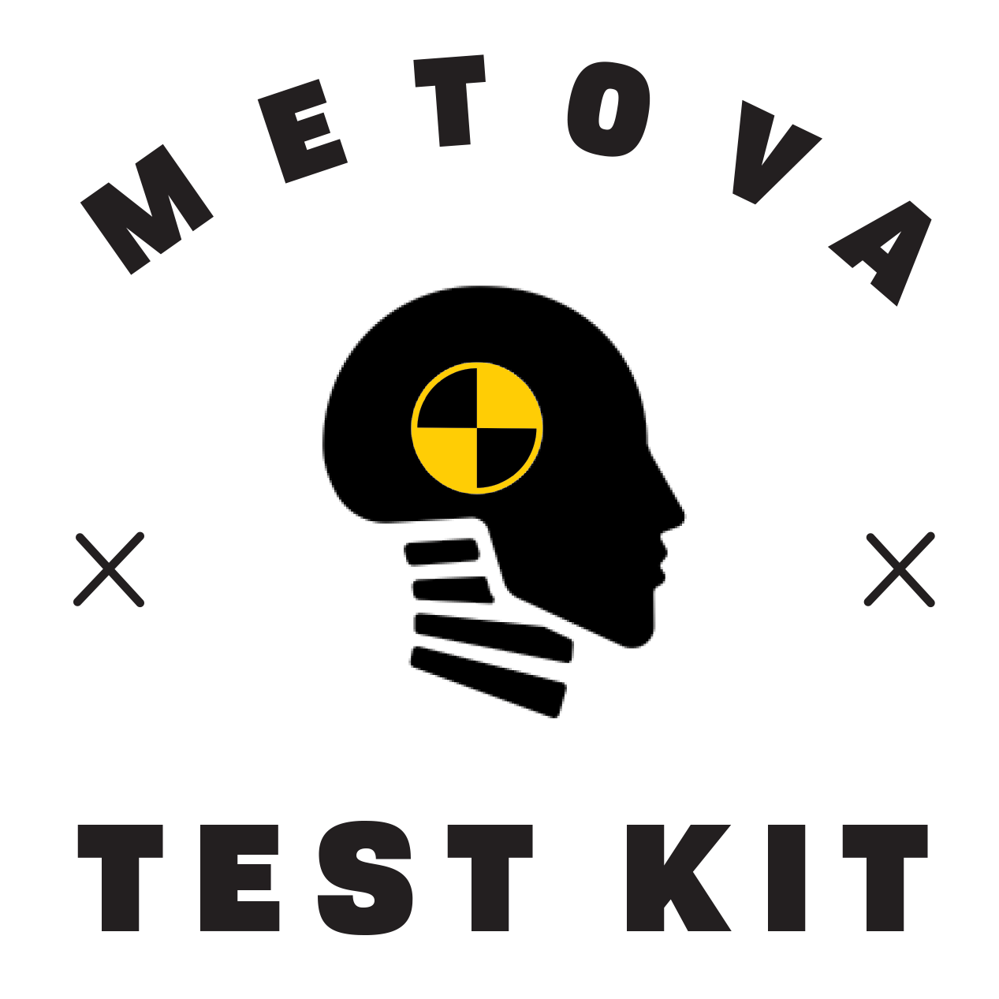

[](https://cocoapods.org/pods/MTK)

<p align="center">
 <a href="https://travis-ci.org/metova/MetovaTestKit" target="_blank"></a> 
 <a href="https://cocoapods.org/pods/MTK" target="_blank"></a> 
 <a href="http://cocoadocs.org/docsets/MTK/" target="_blank"></a>
 <a href="https://coveralls.io/github/metova/MetovaTestKit?branch=master" target="_blank"></a>
 <a href="http://cocoadocs.org/docsets/MTK" target="_blank"></a>
 <a href="http://twitter.com/metova" target="_blank"></a>
 <br/>
</p>
 
Metova Test Kit is a collection of useful test helpers designed to ease the burden of writing tests for iOS applications.

- [Requirements](#requirements)
- [Installation](#installation)
- [Usage](#usage)
    - [MTKTestable Protocol](#mtktestable)
    - [Testing UIKit Components](#testing-uikit-components)
        - [UIControl](#uicontrol)
        - [UIAlertController](#uialertcontroller)
        - [UISegmentedControl](#uisegmentedcontrol)
        - [UIBarButtonItem](#uibarbuttonitem)
    - [Testing Auto Layout Constraints](#testing-auto-layout-constraints)
    - [Testing Exceptions](#testing-exceptions)
    - [Asynchronous Testing](#asynchronous-testing)
- [Credits](#credits)
- [License](#license)

-----

# Requirements

- Swift 3.0
- iOS 8.0

-----

# Installation

Metova Test Kit is available through [CocoaPods](http://cocoapods.org).

Metova Test Kit is intended to be used with unit testing targets. To install it, add MTK your project's Podfile:

```ruby
target 'YourApp' do
  # Your app's pods:
  pod 'DataManager'
  pod 'ThunderCats'
  pod 'MetovaBase'

  target 'YourAppTests' do
    inherit! :search_paths
    pod 'MTK'
  end
end
```

And run `pod install`

If you would like to test a beta version of Metova Test Kit, you can install the latest from develop:

```ruby
pod 'MTK', :git => 'https://github.com/metova/MetovaTestKit.git', :branch => 'develop'
```

-----

# Usage

## MTKTestable

Metova Test Kit defines the `MTKTestable` protocol. Correct implementation of this protocol allows for functional unit testing. It abstracts away the set up and tear down code into extensions of the types you want to test, and allows for functional unit tests.

```swift
func testOutlets() {
    HomeViewControllerClass.test { testVC in
        XCTAssertNotNil(testVC.userameTextField)
        XCTAssertNotNil(testVC.passwordTextField)
        XCTAssertNotNil(testVC.loginButton)
    }
}
```

## Testing UIKit Components
### UIControl
 
With a single assertion, you can verify that your control actions are hooked up and that your target actually responds to the selector that will be sent to it. 

```swift
MTKAssertControl(testVC.loginButton, sends: #selector(LoginViewController.didTapLoginButton(_:)), to: testVC, for: .touchUpInside, "The login button should be hooked up to the login action.") 
```
 
### UIAlertController
 
Verify that a view controller presented an alert having a particular style, title, message, and actions.
 
```swift
MTKAssertAlertIsPresented(
    by: testVC,
    style: .alert,
    title: "Warning",
    message: "Are you sure you want to delete this user?",
    actions: [
        ExpectedAlertAction(title: "Delete", style: .destructive),
        ExpectedAlertAction(title: "Cancel", style: .cancel)
    ]
)
```
 
### UISegmentedControl
 
Verify that a `UISegmentedControl` has the segment titles you are expecting. 
 
```swift
MTKAssertSegmentedControl(segmentedControl, hasSegmentTitles: ["Followers", "Following"])
```
 
### UIBarButtonItem
 
Verify that a bar button item has the expected target/action pair and that the target actually responds to the selector that will be sent to it. 

```swift
MTKAssertBarButtonItem(testVC.editBarButtonItem, sends: #selector(MyViewController.didTapEditButton(_:)), to: testVC) 
```
 
## Testing Auto Layout Constraints

You can use Metova Test Kit to assert that you do not have broken Auto Layout constraints.

```swift
MTKAssertNoBrokenConstraints {
    // code that does anything that impacts the user interface
    // including simply loading a view for the first time
}
```

This assertion will fail for any broken constraints and report the number of constraints that broke during the test. You can also pass a custom message.

```swift
MTKAssertNoBrokenConstraints(message: "Constraints were broken.") {
    // code to test
}
```

This test also returns a value with a count of the number of constraints broken.

```swift
let brokenConstraintCount = MTKAssertNoBrokenConstraints {
    // code to test
}
```

## Testing Exceptions

You can use Metova Test Kit to assert that code that should not throw exceptions doesn't. Without MTK, this would result in the entire test suite crashing. With MTK, this is just a failed test, and you still get to run the rest of the test suite.

```swift
MTKAssertNoException {
    // code that should not throw exceptions
    // results in passing test if no exceptions are thrown
    // results in failing test if exceptions are thrown
}
```

You can also pass a message to print on failure.

```swift
MTKAssertNoException(message: "Exception was thrown.") {
    // code that should not throw exceptions
    // results in passing test if no exceptions are thrown
    // results in failing test if exceptions are thrown
}
```

You can also test code to verify that exceptions are thrown, and can do this without crashing your test suite. If you do not care about the specific exception but only want to verify that the code block throws an exception, you can use `MTKAssertException`:

```swift
MTKAssertException {
    // code that should throw exceptions
    // results in passing test if an exception is thrown
    // results in a failing test if this closure returns without throwing
}
```

Like `MTKAssertNoException`, this function also accepts a message:

```swift
MTKAssertException(message: "No exception was thrown.") {
    // code that should throw exceptions
    // results in passing test if an exception is thrown
    // results in a failing test if this closure returns without throwing
}
```

These methods do return the thrown exception in case you need more information about it.

```swift
guard let exception = MTKAssertException(testBlock: throwingBlock) else {
    XCTFail("Block failed to throw an exception")
    return
}

// More assertion about the given exception that was returned
```

```swift
if let exception = MTKAssertNoException(testBlock: blockThatShouldntThrow) {
    XCTFail("Block should not have thrown but instead threw \(exception)")
    return
}
```

If the closure did not throw an exception, the function returns `nil`. Otherwise, it returns an instance of `NSException` which you can verify is the exception you expected your block to throw.

 
## Asynchronous Testing
 
XCTest provides asynchronous testing capabilities using `expectation(description:)` and `waitForExpectations(timeout:handler:)`. However, when testing simple delayed asynchronous actions, this approach can be cumbersome and the intent might not be immediately obvious. Using MTK's `MTKWaitThenContinueTest(after:testAction:)` utility method, these kinds of tests become simple and they read naturally.
 
```swift
mockUserSearchNetworkRequest(withResponseTime: 0.5)
testViewController.didTapSearchButton()
 
XCTAssertFalse(testViewController.searchButton.isEnabled, "The search button should be disabled while a search request is taking place.")
 
MTKWaitThenContinueTest(after: 1) {
    XCTAssertTrue(testViewController.searchButton.isEnabled, "Once the request is complete, the search button should be re-enabled.") 
}
```
 
-----

# Credits

Metova Test Kit is owned and maintained by [Metova Inc.](https://metova.com)

[Contributors](https://github.com/Metova/MetovaTestKit/graphs/contributors)

If you would like to contribute to Metova Test Kit, see our [CONTRIBUTING](CONTRIBUTING.md) guidelines.

Metova Test Kit banner image and other assets provided by Christi Johnson.

-----

# License

Metova Test Kit is available under the MIT license. See the [LICENSE](LICENSE) file for more info.
